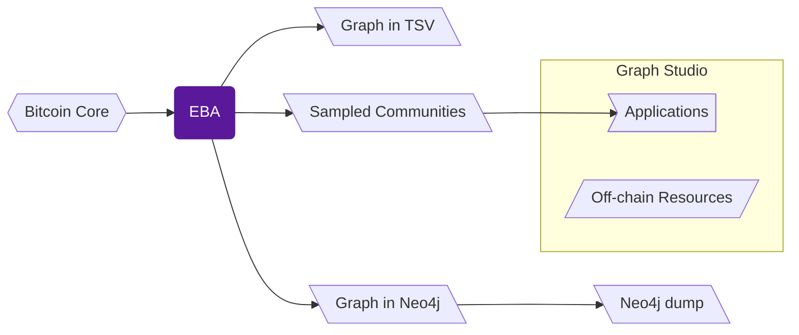

EBA interfaces with the Bitcoin network and 
creates a graph of the full history of transactions recorded on-chain, 
encompassing the complete trading details of over `8.72` billion BTC.
The temporal heterogeneous graph consists of over `2.4` billion nodes and 
`39.72` billion time-stamped edges spanning more than a decade, 
making it a complete resource for developing models on Bitcoin and 
a large-scale resource for benchmarking graph neural networks. 

We share the complete ETL pipeline and all the data it generates. 
To simplify working with the pipeline and its resources, 
we have split them into separate repositories. 
The following resource map will help you navigate to the resources that suit your application. 

