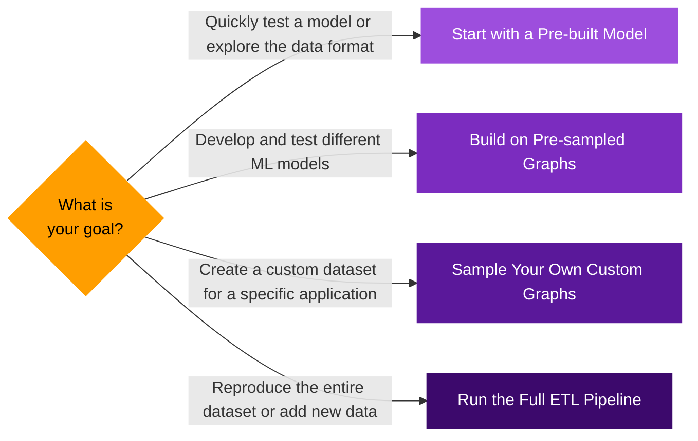

This guide helps you choose the right starting point 
for using our Bitcoin resources. 
The pipeline is fully modular, 
and since we provide the data output for each major step, 
you can begin at the stage that best fits your application 
and available computational resources.

The standard approach for training machine learning models 
on a graph of this scale (tens of billions of nodes) 
is to work with representative subgraphs called 
[sampled communities](/docs/bitcoin/sampling/overview). 
The following options guide you through using the communities 
we've pre-sampled, sampling your own, 
or running the full data pipeline from scratch.

### Start with a Pre-built Model {#opt1}
This is the fastest way to see the data in action. 
We provide "hello-world" models as Jupyter Notebooks 
that include data loading, training, and evaluation 
on pre-sampled communities.

    * **Use Case**: 
        A quick introduction, exploring the dataset, 
        or finding a reference for building your own models.
    * Documentation TODO LINK

### Build on Pre-sampled Graphs {#opt2}

Use communities we've already sampled, 
which lets you focus on model development without 
running the sampling process yourself.

    * **Use Case**: 
        Exploring various model architectures or 
        conceptualizing a new study or application.
    * Documentation TODO LINK

### Sample Your Own Custom Graphs {#opt3}

This approach offers the most flexibility for ML applications. 
By sampling your own communities tailored to your specific needs, 
you can create more relevant datasets and develop more effective models.

    * **Use Case**: 
        Developing specialized ML applications, 
        or benchmarking highly scalable graph-based models.
    * **Requirements**: 
        This is a resource-intensive step. 
        You'll need to host a Neo4j database, 
        which involves downloading a ~1TB database dump and 
        requires ~3TB of total storage. 
        The sampling process itself can take hours to days 
        on machines with limited resources.
    * Documentation TODO LINK

### Run the Full ETL Pipeline from Scratch {#opt4}

This option involves running the entire pipeline, 
starting with syncing a full Bitcoin node to produce the 
graph dataset and block metadata.

    * **Use Case**: 
        You only need this option if you intend to reproduce 
        our entire dataset, add on-chain data we haven't included, 
        or host your own solution that stays current with new blocks.
    * **Requirements**: 
        This process is extremely resource-intensive, 
        requiring terabytes of storage and weeks of runtime on a powerful machine.
    * Documentation TODO LINK
    * If you're interested in getting the data without running the pipeline, we provide the most recent output: please use this link for the graph and this link for the metadata.

