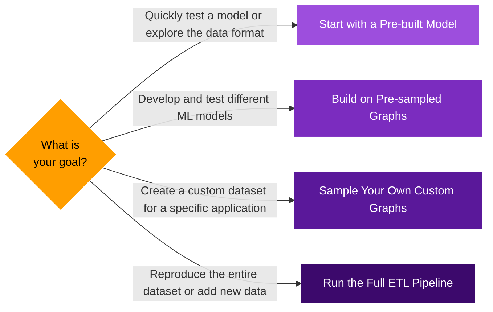

This guide helps you choose the right starting point 
for using our Bitcoin resources. 
The pipeline is fully modular, 
and since we provide the data output for each major step, 
you can begin at the stage that best fits your application 
and available computational resources.

The standard approach for training machine learning models 
on a graph of this scale (tens of billions of nodes) 
is to work with representative subgraphs, aka 
[sampled communities](/docs/bitcoin/sampling/overview). 
The following diagram can help you choose the right starting point for your application.

### Start with a Pre-built Model {#opt1}
This is the fastest way to see the data in action. 
We provide "hello-world" solutions 
that include data loading, model training and evaluation 
on pre-sampled communities.

    * **Use Case**: 
        A quick introduction and exploring the dataset.
    * [Quick-start Bitcoin script node classification](https://github.com/B1AAB/GraphStudio/tree/main/quickstart/script_classification)

### Build on Pre-sampled Graphs {#opt2}

Use communities we've already sampled, 
which lets you focus on model development without 
running the sampling process yourself.

    * **Use Case**: 
        Exploring various model architectures or 
        conceptualizing a new study or application.
    * [Example models and general guidelines for developing your own model](https://github.com/B1AAB/GraphStudio/)

### Sample Your Own Custom Graphs {#opt3}

This approach offers the most flexibility for ML applications. 
By sampling your own communities tailored to your specific needs, 
you can create more relevant datasets and develop more effective models.

    * **Use Case**: 
        Developing specialized ML applications, 
        or benchmarking graph-based models.
    * **Requirements**: 
        This is a resource-intensive step. 
        You'll need to host a Neo4j database, 
        which involves downloading a ~1TB database dump and 
        requires ~3TB of total storage. 
        The sampling process itself can take hours to days 
        on machines with limited resources.
    * [Sampling Documentation](/docs/bitcoin/sampling/overview)

### Run the Full ETL Pipeline from Scratch {#opt4}

This option involves running the entire pipeline, 
starting with syncing a full Bitcoin node to produce the 
Bitcoin Graph dataset and block metadata.

    * **Use Case**: 
        Reproducing the Bitcoin Graph dataset, 
        add on-chain data we haven't included, 
        or host your own solution that stays current with new blocks.
    * **Requirements**: 
        This process is extremely resource-intensive, 
        requiring over 6TB of storage and 4-5 weeks of runtime 
        on a single machine.
    * [ETL pipeline documentation](/docs/bitcoin/etl/overview)
