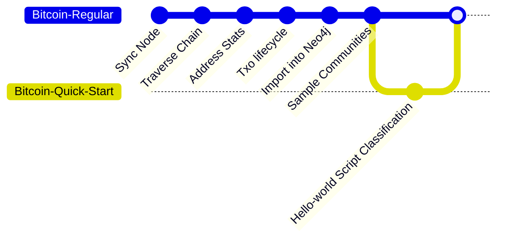

For a quick start, 
we train and evaluate a model to generate node embeddings for 
a Bitcoin script based on its 3-hop neighborhood. 
We experiment with an unsupervised contrastive learning model and 
then use the resulting embeddings to cluster the nodes. 
We then compare these clusters with external annotations that 
identify the wallet to which a script belongs and 
classify wallets as belonging to exchanges, 
mining pools, or gambling services.
For model development, we use this dataset, 
which contains `200k` randomly selected script nodes with 
their neighborhoods sampled using the [Forest-Fire method](/docs/bitcoin/sampling/forest-fire). 
More details on the model and instructions for this quick start 
are available at [this page](https://github.com/B1AAB/GraphStudio/tree/main/quickstart/script_classification).

As the following diagram illustrates, 
this quick start bypasses the ETL pipeline to focus directly on the machine learning application. 
We skip the ETL pipeline because it requires 
weeks of processing and significant computational resources, 
which is beyond the scope of a quick start. 
The complete ETL pipeline is [documented in this section](/docs/bitcoin/etl/overview).

