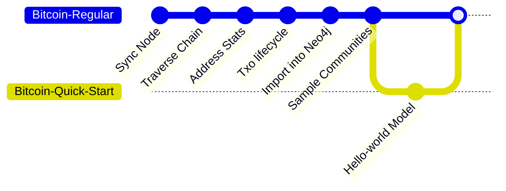

This quick start provides a hands-on guide to training and evaluating 
a Bitcoin script classification model using pre-sampled communities.

As the following diagram illustrates, 
this guide bypasses the ETL pipeline to focus directly on the machine learning application. 
We skip the ETL pipeline because it requires weeks of processing and 
significant computational resources, which is beyond the scope of a quick start. 
The complete ETL pipeline is [documented separately](/docs/bitcoin/etl/overview).

## Bitcoin Script Classification

Please follow 
[this documentation](https://github.com/B1AAB/GraphStudio/tree/main/quickstart/script_classification)
for a "hello world" example on using the sampled Bitcoin communities 
for training and evaluating a script classification model.
